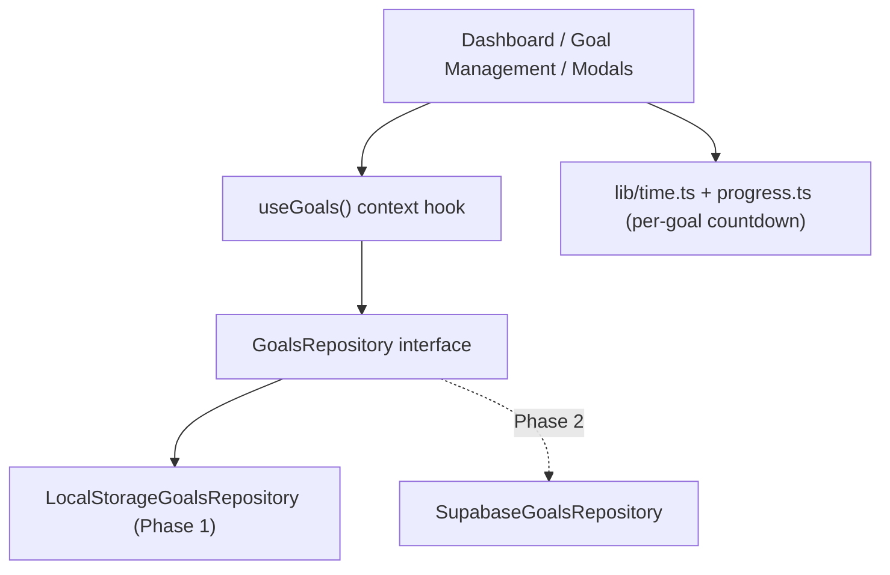

# Year Left — Project Spec

Single source of truth for what the product is and how it behaves today. For build/stack details see `docs/TECHNICAL_IMPLEMENTATION_PLAN.md`; for status and history see `docs/project_state.md`.

Last updated: 2026-06-13 (Phase 1 shipped).

## 1. Overview

**Year Left** (live at https://yearleft.app) is a minimalist web app built around one idea: *time is the scarce resource, so make what's left of the year count.*

It started as an SEO-optimized live countdown to December 31. Phase 1 layered a lightweight, no-login **annual goal tracker** on top of that countdown: users set goals with deadlines, watch each one as its own time-based countdown, and see what they have completed this year.

## 2. Goals and non-goals

### Product goals

- Keep the fast, beautiful, device-time countdown as the front door (and SEO asset).
- Let anyone capture annual goals in seconds, with zero sign-up friction.
- Frame every goal as "time remaining," reinforcing the brand and creating gentle urgency.
- Celebrate completion (achievements) to reward follow-through.

### Non-goals (Phase 1)

- No accounts, login, or server-side data. Goals live only in the visitor's browser.
- No collaboration, sharing, or multi-user features.
- No manual percent-complete tracking, sub-tasks, or reminders.
- No cross-device sync (explicitly deferred to Phase 2).

## 3. Users and core use cases

- **The new-year resolver** — lands in January, sets 2–5 goals with year-end deadlines, checks in periodically.
- **The deadline-driven maker** — sets goals with specific target dates (a launch, a race) and watches the per-goal runway shrink.
- **The drive-by visitor** — arrives via search for "days left in the year," sees the countdown, may or may not create a goal. Must never be blocked by app chrome.

## 4. Features

### 4.1 Countdown (unchanged from pre-Phase-1)

- Live hours/minutes/seconds countdown to Dec 31, 23:59:59 local time.
- Year context: formatted date, day-of-year, ISO week, % of year elapsed, days remaining.
- A daily motivation quote keyed to day-of-year.
- All date-derived UI renders from the **device clock** on the client (never build/server time).

### 4.2 Goals

A goal has: title (required), optional description, a **visual category** (`target | code | palette | other`), a **target deadline**, a creation timestamp, a status, and an optional completion timestamp.

Lifecycle / statuses:

- `active` — counting down to its deadline.
- `completed` — marked done; appears in achievements with a completion date.
- `archived` — retired from view but retained; can be restored.

Actions: create, edit, delete, mark complete, archive, restore (reactivate).

**Progress is time-derived, never stored** — the bar reflects elapsed time from creation toward the deadline, and the card shows whole days remaining. Goals that are overdue or whose deadline slips past Dec 31 are visually flagged.

### 4.3 Dashboard (`/`)

- App nav (logo, Dashboard, Goal Management, Add Goal).
- The full countdown + year context (the SEO-safe, server-rendered hero).
- **My Active Goals** — grid of goal cards plus a "Create New Anchor" tile.
- **What you achieved this year** — completed goals (hidden when there are none).
- Daily motivation quote + footer.

### 4.4 Goal Management (`/goals`)

- Grouped lists: **Active** (with progress + due date), **Completed** (with archive + delete), **Archived** (with restore + delete).
- **JSON export / import** as a manual backup-and-restore safety net (the only persistence guard before accounts exist).
- Marked `noindex` so it never competes with the ranking landing page.

### 4.5 Create / Edit modal

Shared dialog for both create and edit: title, description, target deadline (defaults to Dec 31 of the current year), visual category picker, and a live "Estimated Runway" readout. Edit mode adds Delete.

## 5. Data model

```ts
type GoalStatus = 'active' | 'completed' | 'archived';
type GoalCategory = 'target' | 'code' | 'palette' | 'other';

interface Goal {
  id: string;          // crypto.randomUUID()
  title: string;
  description?: string;
  category: GoalCategory;
  targetDate: string;  // ISO date (yyyy-MM-dd)
  createdAt: string;   // ISO timestamp
  status: GoalStatus;
  completedAt?: string; // ISO timestamp
}
```

Persisted shape in `localStorage` under key `yearleft.goals.v1`:

```json
{ "version": 1, "goals": [ /* Goal[] */ ] }
```

The `version` field exists so the stored shape can be migrated without corrupting old data.

## 6. Architecture



- **Storage** (`src/lib/goals/`): `types.ts`, `repository.ts` (the `GoalsRepository` interface), `local-storage-repository.ts` (versioned, validated), `progress.ts` (time math, reuses `src/lib/time.ts`).
- **State** (`src/hooks/use-goals.tsx`): `GoalsProvider` + `useGoals()` — the single in-memory source of truth. Hydrates from storage after mount (mirrors `useNow`) so server HTML stays static and there is no hydration mismatch. Owns the create/edit dialog state.
- **Shell** (`src/components/app-shell.tsx`): wraps the app via the root layout with the provider, nav, shared dialog, and footer.
- **UI** (`src/components/goals/`): goal-card, active-goals-section, achievements-section, goal-form-dialog, empty-state (create tile), goal-management-view, goal-category.

The `GoalsRepository` interface is the key seam: Phase 2 swaps the implementation in one place without touching the React layer or components.

## 7. Routes

| Route | Purpose | Indexed |
| --- | --- | --- |
| `/` | Dashboard: countdown + active goals + achievements | Yes (SEO landing) |
| `/goals` | Goal management + export/import | No (`noindex`) |
| `/sitemap.xml`, `/robots.txt` | SEO infrastructure | n/a |

## 8. Tech stack

Next.js 15 (App Router) · React 19 · TypeScript (strict) · Tailwind CSS 3 + shadcn/ui (New York, neutral) · Luxon · lucide-react. Deployed on Vercel; Node pinned to `24.x`. No backend in Phase 1.

## 9. SEO and privacy posture

- The countdown content is server-rendered and identical for crawlers regardless of goals, protecting existing rankings for queries like "days left in the year."
- Goals are client-only and never leave the browser in Phase 1 — no accounts, no tracking of goal content, minimal privacy surface.
- Known risk: `localStorage` can be cleared by the user or evicted by the browser (e.g. Safari ITP), and does not sync across devices. JSON export/import is the interim mitigation; durable persistence is Phase 2.

## 10. Roadmap

### Phase 2 — persistence (next)

- `SupabaseGoalsRepository` implementing `GoalsRepository` (Supabase already configured).
- Supabase Auth with Google OAuth; an info affordance on the dashboard ("sign in to sync across devices").
- Anonymous → authenticated migration: push local goals to the account on first sign-in.

### Later / optional

- Per-goal reminders or notifications, streaks, and "carry over to next year."
- SEO enrichment (OG image, favicon, manifest, crawlable About/FAQ, Search Console).
- Light/dark theme toggle; unit tests for `src/lib/time.ts`.

## 11. Resolved decisions

- **Overdue goals** stay `active` and show an "Overdue" flag until the user acts (no auto-archive).
- **Annual reset:** goals do **not** roll over into a new year — each year stands on its own. Goals are scoped to the year they belong to, and a new year starts with a clean slate. (Implementation of the year boundary is deferred; no rollover logic should be added.)
- **Phase 2 sign-in is optional** — the app stays local-first, with sign-in offered purely as opt-in cross-device sync, never a gate to creating goals.

## 12. Open questions

- None currently. (Revisit the annual-reset mechanics — e.g. how prior-year goals are surfaced or hidden — when Phase 2 persistence lands.)
